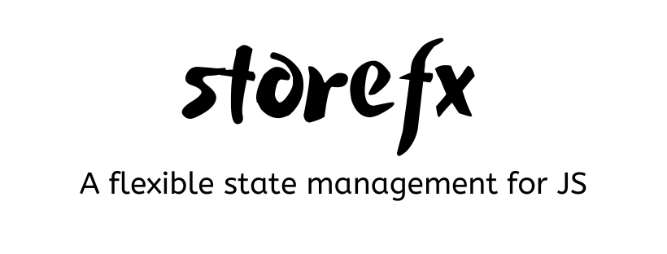

## ⚠️ Recent started development ⚠️
*More information in the coming months*

## **:handshake: Contributing**

* Fork it!
* Create your feature branch: `git checkout -b my-new-feature` 
* Commit your changes: `git commit -am 'Add some feature'` 
* Push to the branch: `git push origin my-new-feature` 
* Submit a pull request

---

### **:busts_in_silhouette: Credits**

* [Chris Michael](https://github.com/ChrisMichaelPerezSantiago) (Project Leader, and Developer)

---

### **:anger: Troubleshootings**

This is just a personal project created for study / demonstration purpose and to simplify my working life, it may or may
not be a good fit for your project(s).

---

### **:heart: Show your support**

Please :star: this repository if you like it or this project helped you!\
Feel free to open issues or submit pull-requests to help me improving my work.

---

### **:robot: Author**

_*Chris Michael*_

> You can follow me on

[github](https://github.com/ChrisMichaelPerezSantiago)&nbsp; &middot; &nbsp; [twitter](https://twitter.com/Chris5855M)

